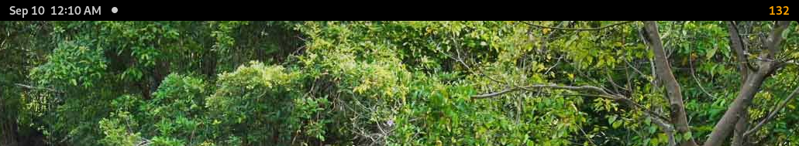

# gnome-shell-extension-air-quality
An extension to display the air quality index (AQI) from local Purple Air sensors in the top bar of gnome-shell

## Installation

### From extensions.gnome.org

Submitted and pending approval

### From git

    git clone git@github.com:mcardillo55/gnome-shell-extension-air-quality.git
    cp -r air-quality@mcardillo55 ~/.local/share/gnome-shell/extensions/
